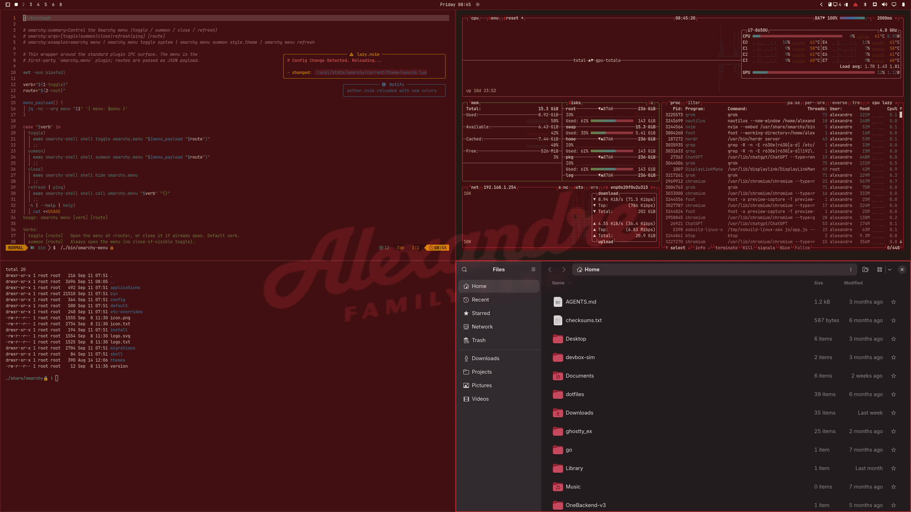

# Alexandre Family Farm Dark

Dark Omarchy theme from [Alexandre Family Farm](https://alexandrefamilyfarm.com/) — wine `#410f11`, cream `#fff6e4`, barn red `#d13139`.

Pair: [light variant](https://github.com/dl-alexandre/omarchy-alexandre-family-farm-theme)

## Install

```bash
omarchy theme install https://github.com/dl-alexandre/omarchy-alexandre-family-farm-dark-theme.git
```

Or *Install > Style > Theme* and paste that URL.

## About and screensaver

Omarchy never applies a theme's About/fastfetch logo or screensaver by itself. A `theme-set` hook does that.

You can have several theme-set hooks. There is only **one branding hook**, named `theme-set-branding`. This theme and the MILC One pair ship the same file, so install it **once per machine**:

```bash
omarchy hook install theme-set ~/.config/omarchy/themes/alexandre-family-farm-dark/theme-set-branding
omarchy theme set "Alexandre Family Farm Dark"
```

After that, every theme switch runs it automatically. Do not reinstall it when changing light/dark or between AFF and MILC. Re-run `omarchy hook install` only if `theme-set-branding` in this repo changed.

## Preview



## License

All rights reserved. Personal Omarchy use only; logo and photos stay with Alexandre Family Farm.
